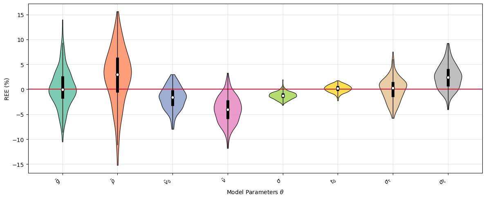
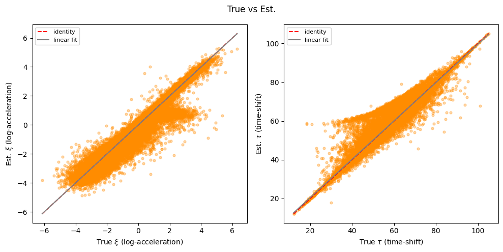
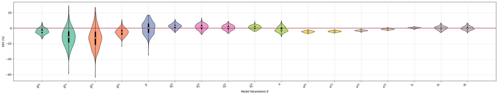
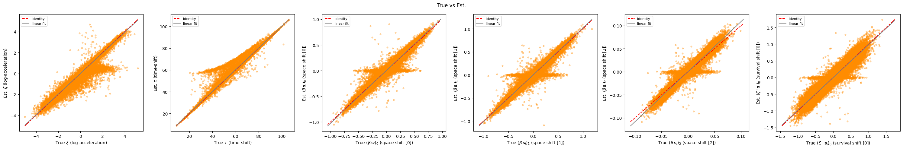

# Univariate Model

- **Feature: `ALSFRS_R_TOTAL`**
- Dimension: 1, Source dimension: 0, Nb of events: 1

## Population-level parameters

### Population parameter recovery metrics.
| Parameter | θ (true) | θ mean (M) | RB (%) | RRMSE (%) | RSE |
|---|---|---|---|---|---|
| $g$ | 3.60714 | 3.62279 | 0.434 [-0.266, 1.139] | 4.994 [4.351, 5.607] | 0.0497 [0.0434, 0.0552] |
| $\rho$ | 2.2199 | 2.26963 | 2.240 [1.603, 2.859] | 5.078 [4.652, 5.511] | 0.0447 [0.0401, 0.0492] |
| $v_0$ | 0.09633 | 0.09257 | -3.899 [-4.595, -3.191] | 6.386 [5.784, 6.957] | 0.0528 [0.0480, 0.0573] |
| $\nu$ | 6.12633 | 6.60375 | 7.793 [7.050, 8.495] | 9.402 [8.702, 10.108] | 0.0489 [0.0441, 0.0534] |
| $\sigma$ | 0.04065 | 0.04015 | -1.227 [-1.325, -1.119] | 1.432 [1.341, 1.515] | 0.0075 [0.0066, 0.0084] |
| $t_0$ | 57.97774 | 58.07585 | 0.169 [0.068, 0.270] | 0.734 [0.667, 0.801] | 0.0071 [0.0064, 0.0079] |
| $\sigma_{\tau}$ | 11.07444 | 11.07183 | -0.024 [-0.348, 0.301] | 2.361 [2.119, 2.592] | 0.0237 [0.0212, 0.0259] |
| $\sigma_{\xi}$ | 1.31839 | 1.35156 | 2.516 [2.190, 2.860] | 3.533 [3.237, 3.857] | 0.0243 [0.0221, 0.0264] |

### Relative error of estimation (REE) for all parameters.

## Individual-level parameters

### Individual random effect recovery metrics.
| Parameter | ICC(3,1) | Pearson r |
|---|---|---|
| $\xi_i$ | 0.984 +/- 0.003 | 0.984 +/- 0.003 |
| $\tau_i$ | 0.993 +/- 0.003 | 0.993 +/- 0.003 |

### Scatter plots of estimated vs. true individual parameters across all repetitions.

# Multivariate Model

- **Features: "ALSFRS_R_BULBAR", "ALSFRS_R_FINE_MOTOR", "ALSFRS_R_GROSS_MOTOR", "ALSFRS_R_TOTAL"**
- Dimension: 4, Source dimension: 2, Nb of events: 1

## Population-level parameters

### Population parameter recovery metrics.

| Parameter | θ (true) | θ mean (M) | RB (%) | RRMSE (%) | RSE |
|---|---|---|---|---|---|
| $g^{(0)}$ | 10.46093 | 9.59545 | -8.273 [-9.407, -7.232] | 11.410 [10.596, 12.276] | 0.0859 [0.0761, 0.0945] |
| $g^{(1)}$ | 2.32638 | 2.12161 | -8.802 [-10.033, -7.522] | 12.605 [11.546, 13.660] | 0.0992 [0.0869, 0.1108] |
| $g^{(2)}$ | 1.95103 | 1.80268 | -7.604 [-8.711, -6.516] | 11.158 [10.257, 12.055] | 0.0886 [0.0786, 0.0981] |
| $g^{(3)}$ | 3.41464 | 3.21262 | -5.916 [-6.681, -5.167] | 8.093 [7.455, 8.764] | 0.0588 [0.0519, 0.0655] |
| $\rho$ | 1.84938 | 1.85117 | 0.097 [-0.609, 0.808] | 5.012 [4.502, 5.505] | 0.0502 [0.0449, 0.0552] |
| $v_0^{(0)}$ | 0.0775 | 0.08251 | 6.457 [5.319, 7.651] | 10.532 [9.558, 11.533] | 0.0783 [0.0702, 0.0855] |
| $v_0^{(1)}$ | 0.25721 | 0.26295 | 2.233 [1.535, 2.934] | 5.565 [5.045, 6.116] | 0.0500 [0.0451, 0.0544] |
| $v_0^{(2)}$ | 0.23838 | 0.24105 | 1.121 [0.524, 1.737] | 4.521 [4.115, 4.924] | 0.0434 [0.0393, 0.0471] |
| $v_0^{(3)}$ | 0.13258 | 0.13529 | 2.046 [1.371, 2.728] | 5.250 [4.750, 5.782] | 0.0475 [0.0428, 0.0518] |
| $\nu$ | 4.04743 | 4.14158 | 2.326 [1.642, 3.003] | 5.430 [4.972, 5.911] | 0.0481 [0.0432, 0.0525] |
| $\sigma^{(0)}$ | 0.06865 | 0.06549 | -4.601 [-4.761, -4.449] | 4.734 [4.581, 4.889] | 0.0117 [0.0106, 0.0127] |
| $\sigma^{(1)}$ | 0.07858 | 0.07531 | -4.158 [-4.284, -4.040] | 4.253 [4.137, 4.378] | 0.0094 [0.0085, 0.0102] |
| $\sigma^{(2)}$ | 0.07429 | 0.072 | -3.075 [-3.173, -2.971] | 3.173 [3.068, 3.269] | 0.0081 [0.0072, 0.0089] |
| $\sigma^{(3)}$ | 0.04472 | 0.04416 | -1.255 [-1.366, -1.146] | 1.467 [1.372, 1.559] | 0.0077 [0.0070, 0.0085] |
| $t_0$ | 56.69895 | 56.94823 | 0.440 [0.345, 0.532] | 0.829 [0.761, 0.895] | 0.0070 [0.0063, 0.0077] |
| $\sigma_{\tau}$ | 11.6298 | 11.63862 | 0.076 [-0.238, 0.382] | 2.318 [2.098, 2.540] | 0.0232 [0.0210, 0.0254] |
| $\sigma_{\xi}$ | 1.0783 | 1.07868 | 0.034 [-0.265, 0.370] | 2.323 [2.105, 2.555] | 0.0233 [0.0211, 0.0255] |

### Relative error of estimation (REE) for all parameters.

## Individual-level parameters

### Individual random effect recovery metrics.
| Parameter | ICC(3,1) | Pearson r |
|---|---|---|
| $\xi_i$ | 0.988 +/- 0.004 | 0.989 +/- 0.004 |
| $\tau_i$ | 0.995 +/- 0.002 | 0.995 +/- 0.002 |
| $\text{w}_i^{(0)}$ | 0.989 +/- 0.003 | 0.990 +/- 0.003 |
| $\text{w}_i^{(1)}$ | 0.990 +/- 0.003 | 0.991 +/- 0.003 |
| $\text{w}_i^{(2)}$ | 0.982 +/- 0.011 | 0.991 +/- 0.003 |
| $\boldsymbol{\zeta}^\top \mathbf{s}_i$ | 0.965 +/- 0.027 | 0.978 +/- 0.013 |

### Scatter plots of estimated vs. true individual parameters across all repetitions.
